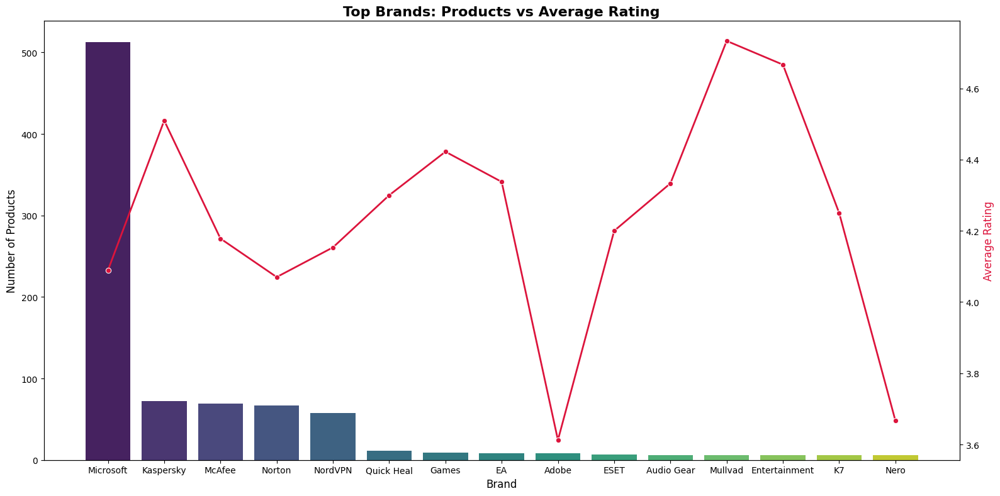
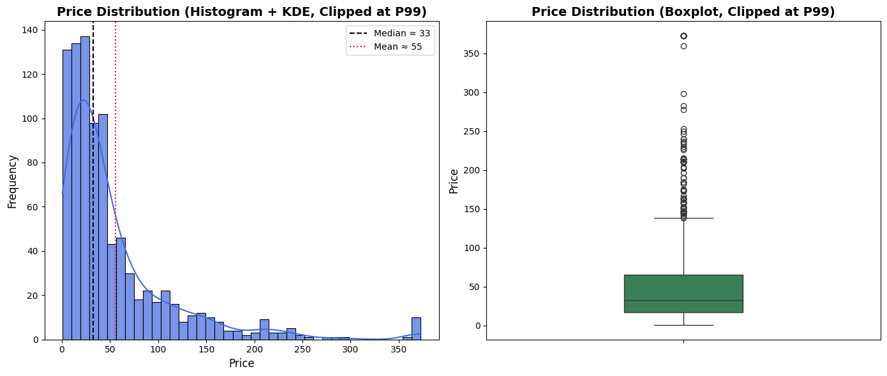
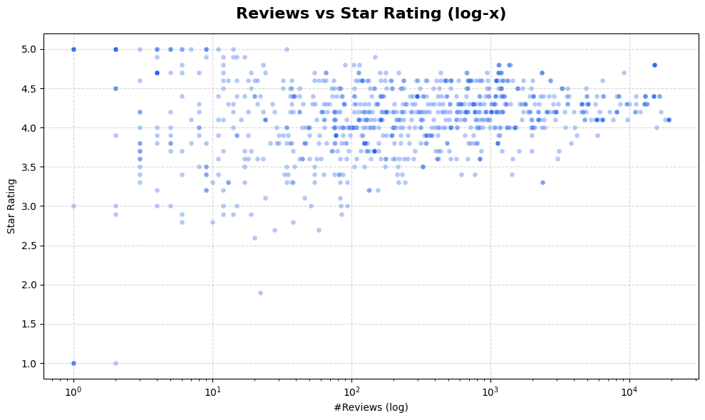
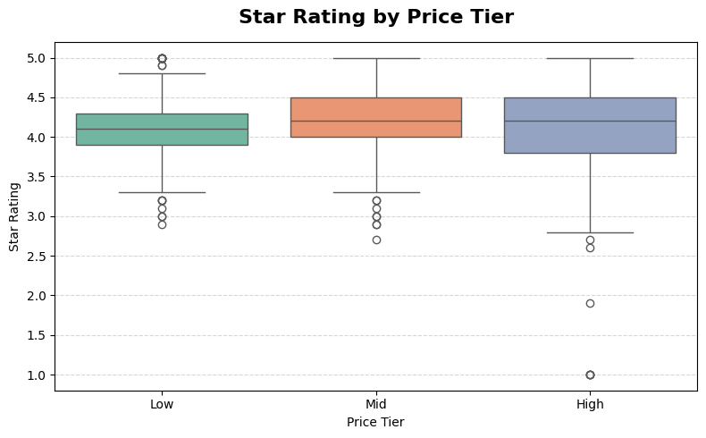

# 🛒 Amazon Bestsellers Analysis 2025

A clean, reproducible analysis of the **Amazon Bestsellers 2025** dataset. The project focuses on **data cleaning**, **currency normalization**, **brand extraction**, **descriptive statistics**, and **visualizations** to reveal insights about **pricing**, **ratings**, **brand performance**, and **cross‑country patterns**.

---

## Table of Contents
- [Project Overview](#project-overview)  
- [Project Structure](#project-structure)  
- [Dependencies & Installation](#dependencies--installation)  
- [Quick Start](#quick-start)  
- [Dataset Description](#dataset-description)  
- [Data Pipeline](#data-pipeline)  
- [Analysis & Visualizations](#analysis--visualizations)  
  - [Country-Level Metrics](#country-level-metrics)  
  - [Price Distribution by Country](#price-distribution-by-country)  
  - [Brand Analysis](#brand-analysis)  
  - [Price Analysis](#price-analysis)  
  - [Ratings Analysis](#ratings-analysis)  
  - [Correlation Matrix](#correlation-matrix)  
- [Results (Detailed)](#results-detailed)  
- [Business Insights (Extended)](#business-insights-extended)  
- [Helper Functions](#helper-functions)  
- [Future Work](#future-work)  
- [License](#license)  

## Project Overview
This project analyzes the Amazon Bestsellers 2025 dataset, focusing on data cleaning, currency normalization, brand mapping, descriptive statistics, and visualization. The goal is to uncover insights into pricing, ratings, brand performance, and cross-country trends.

## Project Structure

├─ data/
│ └─ Amazon_bestsellers_items_2025.csv
├─ notebooks/
│ └─ AmazonBestSeller.ipynb
├─ exports/
│ └─ AmazonBestSeller2.html
├─ reqs/
│ └─ requirements.txt

## Dependencies & Installation
pip install pandas numpy matplotlib seaborn

## Quick Start
Place the dataset under /data.
Open the notebook or run Python scripts with the helper functions.
Adjust currency exchange rates as needed.
Execute the analysis to generate tables and visualizations.

## Dataset Description
Key columns:
product_title, product_price, product_star_rating, product_num_ratings, product_num_reviews, country, rank, asin, page.

## Data Pipeline
Price Cleaning: Extract numeric values and normalize to USD.
Currency Normalization: Map country → currency, apply exchange rates.
Ratings & Reviews Cleaning: Convert to numeric, clip to valid ranges.

Correlation Matrix: Compute Spearman correlations across features (price, rating, num_ratings, rank_inv).
## Analysis & Visualizations
### Country-Level Metrics
Aggregates: item counts, average rating, average price.
Visualization: grouped barplots (rating vs price).

### Price Distribution by Country
Boxplot with log scale to highlight outliers.

### Brand Analysis
#### 1. Extract Brand Hybrid
A custom function maps product titles to brands using an alias dictionary (multi-language) with fallback heuristics.

#### 2. Brand Counts
Count of products per brand.
Visualization: barplot of Top-N brands.
Useful for focusing on statistically significant brands.

#### 3. Brand × Country Crosstab
Cross-tabulation of brands by country.
Visualization: heatmap to reveal brand penetration by geography.

#### 4. Price by Brand
Boxplot (log scale) of prices by brand.
Identifies premium vs budget brands.

#### 5. Rating by Brand
Violin/Boxplot of star ratings grouped by brand.
Shows brand reputation patterns.

### Price Analysis
Distribution: Histogram + KDE and Boxplot.
Percentiles: q05 ≈ 3.35, q25 ≈ 16.8, q50 ≈ 32.7, q75 ≈ 65.4, q95 ≈ 177.2.
Insight: Most products fall between $17–65, but a small subset of expensive products creates a long right tail.

### Ratings Analysis
Distribution: average ≈ 4.14, median 4.2, range 1–5.
Dataset shape after cleaning ratings: (969, 13).
Insight: Ratings are clean and skewed positively, typical of Amazon.

### Correlation Matrix
Spearman correlations:
Price ↔ Rating ≈ +0.078 (very weak positive).
Price ↔ Num Ratings ≈ −0.150 (weak negative).
Rating ↔ Num Ratings ≈ +0.116 (weak positive).
Num Ratings ↔ Rank_inv ≈ +0.222 (moderate positive).
Insight: Prices are not strongly related to ratings. Number of ratings has the strongest (but still moderate) association with bestseller rank.

## Results 
### Dataset Overview
- Final shape after cleaning: **969 rows × 13 columns**  
- No missing values in `product_star_rating`

### Price Distribution
| Quantile | Price (USD) |
| -------- | ----------- |
| Min      | 0.99        |
| q05      | 3.35        |
| q25      | 16.78       |
| q50      | 32.69       |
| q75      | 65.39       |
| q95      | 177.17      |
| Max      | >1000       |

- Histogram & KDE: right-skewed  
- Boxplot (log scale): clear cluster at **$20–70**

### Ratings Distribution
- Mean ≈ **4.14**  
- Median ≈ **4.2**  
- Std ≈ **0.5**  
- Range: **1 – 5**  
- Skew: heavily positive  

### Number of Ratings / Reviews
- Range: **0 – 50,000+**  
- Median ≈ **1,200 ratings**  
- Heavy-tailed distribution  

### Correlation Matrix
- Price vs Rating: **+0.078**  
- Price vs Num Ratings: **−0.150**  
- Rating vs Num Ratings: **+0.116**  
- Num Ratings vs Rank_inv: **+0.222**

### Country-Level Analysis
- Countries: US, IN, JP, DE, FR, ES, IT, MX, CA, AU  
- US & IN dominate item counts  
- Median prices: US ~$30–35, JP & DE ~$45–55, IN ~$10–15  
- Ratings: consistent 4.0–4.3  

| Country | Count | Median Price (USD) | Avg Rating |
| ------- | ----- | ------------------ | ---------- |
| US      | High  | 30–35              | \~4.1–4.2  |
| IN      | High  | 10–15              | \~4.1      |
| JP      | Mid   | 45–55              | \~4.2      |
| DE      | Mid   | 45–55              | \~4.2      |
| Others  | Low   | 20–40              | \~4.0–4.3  |

### Brand-Level Analysis
- Top brands: **Microsoft, Adobe, Apple, Norton, Kaspersky, McAfee**  
- Premium (Adobe, Apple, Microsoft): $70–150+  
- Budget (Quick Heal, AVG, K7): $10–25  
- Ratings: Premium ~4.2–4.4, Security ~4.0–4.1  

### Figures

#### 1. Price Distribution by Country (log scale)
Highlights variability in pricing across countries. Mexico and Australia show wide spreads and high-end outliers.

---

#### 2. Brand vs Country Heatmap
Visualizes the density of brand group presence across regions. Office software dominates; security strong in Germany & India.

---

#### 3. Price vs Rating (Scatter Plot)
Shows that high price doesn't correlate with high ratings. Many budget products receive top reviews, and vice versa.

---

#### 4. Correlation Matrix (Spearman)
Reveals weak to moderate relationships. Number of ratings has strongest link to bestseller rank; price and rating barely correlate.

## Business Insights (Extended)

### 1. Pricing Strategy
- Sweet spot: **$17–65**  
- Premium tier: **$70–150+**  
- Budget tier: **$10–20**  
- Actionable: target $20–60 globally; premium brands can justify higher pricing  

### 2. Ratings & Customer Trust
- Positive bias: avg ~4.14  
- Engagement (number of ratings) matters more than score  
- Actionable: invest in review acquisition strategies  

### 3. Geographic Strategies
- India: budget brands thrive  
- Japan & Germany: premium-friendly  
- US/EU: dominated by global giants  
- Actionable: use localized pricing  

### 4. Brand Positioning
- Premium vs Budget segmentation is clear  
- Premium brands → strong global trust  
- Budget security tools succeed in sensitive markets  
- Actionable: smaller brands should differentiate via niche/local support  

### 5. Competitive Landscape
- Long-tail brands show fragmentation  
- Low entry barriers but scaling challenges  
- Actionable: potential for consolidation or alliances  

### 6. Market Opportunities
- Mid-tier products ($40–70) can capture undecided buyers  
- Localized solutions for India & LATAM  
- Actionable: combine engagement growth with regional pricing  

---

## Helper Functions
- `clean_price_value`  
- `convert_price`  
- `_to_float_safe` / `_to_int_safe_nonneg`  
- `extract_brand_hybrid`  

---

## Future Work
- Real-time currency API integration  
- Fuzzy matching for brands  
- Thematic brand grouping  
- Tier-based analysis  
- Predictive ML models  
